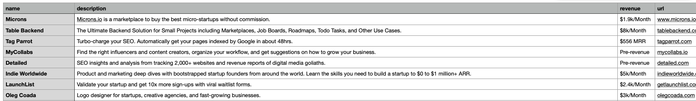

# Web Scraping Examples

Welcome to the Web Scraping Examples repository! Here, I demonstrate my expertise in web scraping using Python and JavaScript. With these examples, I can extract any kind of information from web pages and provide the results in the desired format.

## Skills

- **Efficient Data Extraction:** I excel at implementing the best solutions and employing highly efficient methods to extract the information you desire.
- **Flexible Data Delivery:** I can deliver the extracted data in the format of your choice, whether it's JSON, CSV, or any other preferred format. Alternatively, I can add the data directly to your database or send it to a service like AWS S3.
- **Automated Daily Scraping:** If you require daily data updates, I can deploy these scrapers in various environments, such as AWS, GCC, VPS, or dedicated servers, ensuring that you receive the latest information consistently.

## Examples

### JSON Format Result

Here's an example of the result in JSON format:

```json
[
  {
    "name": "Microns",
    "description": "Microns.io is a marketplace to buy the best micro-startups without commission.",
    "revenue": "$1.9k/Month",
    "url": "https://www.microns.io",
    "data": {
      "launched in": "2021",
      "no. of founders": "Solo-founder",
      "location": "Ukraine",
      "funding": "Bootstrapped",
      "monetisation": "Subscriptions",
      "commitment": "Full-time",
      "category": "Marketplace",
      "founder": "Ilya Novohatskyi",
      "updated on": "Jun 19, 2023"
    }
  },
  {
    "name": "Table Backend",
    "description": "The Ultimate Backend Solution for Small Projects including Marketplaces, Job Boards, Roadmaps, Todo Tasks, and Other Use Cases.",
    "revenue": "$8k/Month",
    "url": "https://tablebackend.com",
    "data": {
      "launched in": "2023",
      "no. of founders": "Solo-founder",
      "location": "Delaware, USA",
      "funding": "Bootstrapped",
      "monetisation": "Subscriptions",
      "commitment": "Full-time",
      "category": "SaaS",
      "founder": "Mohd Danish",
      "updated on": "Jun 20, 2023"
    }
  }
]
```

### CSV Format Result

Below is an example of the generated CSV file containing all the extracted data:



## Contact Me

If you have any questions or are ready to work with me, please don't hesitate to reach out. I am eager to discuss your specific requirements and provide you with high-quality web scraping solutions. Let's connect and achieve your data extraction goals together!
